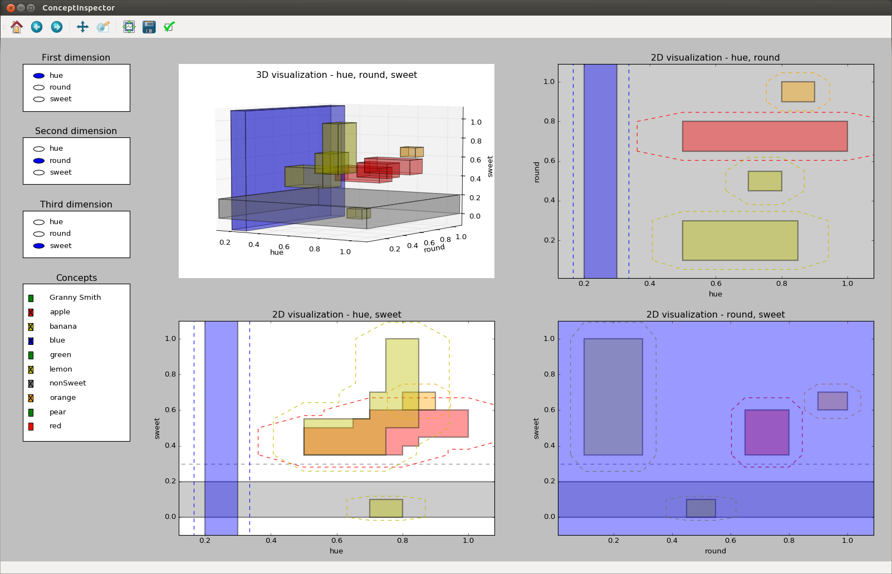

# ConceptualSpaces
Version 1.0.0: [](https://doi.org/10.5281/zenodo.825459) [Release](https://github.com/lbechberger/ConceptualSpaces/releases/tag/v1.0.0)

Version 1.1.0: [](https://doi.org/10.5281/zenodo.1143978) [Release](https://github.com/lbechberger/ConceptualSpaces/releases/tag/v1.1.0)

This repository contains a thorough implementation of the conceptual spaces framework.

Relevant publications about this implementation and its underlying mathematical formalization include:
- Lucas Bechberger and Kai-Uwe Kühnberger. "A Thorough Formalization of Conceptual Spaces". 40th German Conference on Artificial Intelligence, 2017. [Paper](https://link.springer.com/chapter/10.1007/978-3-319-67190-1_5) [Preprint](https://arxiv.org/abs/1706.06366)
- Lucas Bechberger and Kai-Uwe Kühnberger. "Measuring Relations Between Concepts In Conceptual Spaces". 37th SGAI International Conference on Artificial Intelligence, 2017. [Paper](https://link.springer.com/chapter/10.1007%2F978-3-319-71078-5_7) [Preprint](https://arxiv.org/abs/1707.02292)
- Lucas Bechberger and Kai-Uwe Kühnberger. "A Comprehensive Implementation of Conceptual Spaces". 5th International Workshop on Artificial Intelligence and Cognition, 2017. [Preprint](https://arxiv.org/abs/1707.05165)

If you find this implementation or its underlying formalization useful and plan to use it in your own work, please cite one of the above papers. Thank you!

## About

Our implementation uses Python 2.7. Currently, our code has the following dependencies (outside of the standard library): scipy, matplotlib, Shapely. You should be able to install them by executing `pip install -r requirements.txt`. If you have trouble getting scipy to work, please refer to the [official scipy website](https://www.scipy.org/install.html) for further assistance. Same holds for [matplotlib](https://matplotlib.org/users/installing.html).

## Overview

We provide a short overview of our framework in the following sections.

### Defining a Conceptual Space

A conceptual space can be defined as follows:
```python
import cs.cs as space
domains = {"color":[0], "shape":[1], "taste":[2]}
space.init(3, domains)
```

The first line imports the module responsible for representing the overall conceptual space.

The second line provides the domain structure of the space. In this case, we have three domains: color, shape, and taste. Each of them consists of a single dimension.
The domain structure is thus a dictionary mapping from domain names to list of dimension indices. Note that each dimension of the space must belong to exactly one domain.

The third line initializes the space with the desired number of dimensions and the specified domain structure. Note that the number of dimension given here and the number of dimensions in the domain structure must match.

### Defining a Concept

We can now define a concept as follows:
```python
c_pear = Cuboid([0.5, 0.4, 0.35], [0.7, 0.6, 0.45], domains)
s_pear = Core([c_pear], domains)
w_dim = {"color":{0:1}, "shape":{1:1}, "taste":{2:1}}
w_pear = Weights({"color":0.50, "shape":1.25, "taste":1.25}, w_dim)
pear = Concept(s_pear, 1.0, 12.0, w_pear)
```
The first line defines a cuboid with the support points `p_min = [0.5, 0.4, 0.35]` and `p_max = [0.7, 0.6, 0.45]`. Note that this cuboid is defined on the whole space, as there are values for all three dimensions. This is also the reason why we pass the overall domain structure as a second argument - the cuboid is defined on all domains.

The second line builds a core out of this single cuboid. In theory, we can give a list of multiple cuboids as a first parameter to this constructor. The only constraint is that these cuboids need to have a nonempty intersection. We also need again to specify the set of domains on which this core is defined (which in this case is again the whole space).

The third line defines a set of weights for the dimensions. As the sum of dimension weights within each dimension must equal 1.0, and as each domain only contains a single dimension, all the dimension weights are set to 1.0 here.

The fourth line defines the domain weights and the overall weights parameter. As one can see, the 'shape' and the 'taste' domain are weighted higher than the 'color' domain in this case. Note that the sum of the domain weights must equal the number of domains. If the provided numbers don't add up, the constructor of the Weights class will normalize them automatically.

Finally, the fifth line creates the 'pear' concept. We use the core defined in line 2 and the weights defined in line 4. The maximal membership is set to 1.0 and the sensitivity parameter (which controls the rate of the membership function's exponential decay) is set to 12.

For convenience, the conceptual space also contains a dictionary for storing concepts. We can add our newly created concept to this dictionary under the identifier 'pear' as follows:
```python
space.add_concept("pear", pear)
```

In the file `conceptual_spaces/demo/fruit_space.py`, we have already defined several concepts for different types of fruit along with some properties.
Variables for fruit concepts (with identifiers in parentheses): pear ('pear'), orange ('orange'), lemon ('lemon'), granny_smith ('Granny Smith'), apple ('apple'), banana ('banana').
Variables for properties: red ('red'), green, ('green'), blue ('blue'), non_sweet ('nonSweet').
There is also a `demo()` function in this file that displays the information of this readme file.

The folder `conceptual_spaces/demo/images/` contains some 2D and 3D visualizations of these concepts.

We can display a concept by simply printing it:
```python
print pear
    core: {[0.5, 0.4, 0.35]-[0.7, 0.6, 0.45]}
    mu: 1.0
    c: 12.0
    weights: <{'color': 0.5, 'taste': 1.25, 'shape': 1.25},{'color': {0: 1.0}, 'taste': {2: 1.0}, 'shape': {1: 1.0}}>
```
### Operations on Concepts

We can execute the following operations on a concept `c`:
- `c.membership_of(x)`: computes the membership of a point `x` to the concept `c`.
- `c.intersect_with(d)`: computes the intersection of the concepts `c` and `d`.
- `c.unify_with(d)`: computes the unification of the two concepts `c` and `d`.
- `c.project_onto(domains)`: projects the concept `c` onto the given domains.
- `c.cut_at(dimension, value)`: cuts the concept `c` into two parts. The cut is placed at the given value on the given dimension.
- `c.size()`: computes the size of the concept `c`.
- `c.subset_of(d)`: computes the degree to which the concept `c` is a subset of the concept `d`.
- `c.implies(d)`: computes the degree to which the concept `c` implies the concept `d`.
- `c.similarity_to(d)`: computes the degree of similarity between the concept `c` and the concept `d`.
- `c.between(d, e)`: decides whether the concept `c` is between the concepts `d` and `e`.

Let us illustrate these operations with some examples.

```python
pear.membership_of([0.6, 0.5, 0.4])
    1.0
pear.membership_of([0.3, 0.2, 0.1])
    0.0003526621646282561
print pear.intersect_with(apple)
    core: {[0.5, 0.625, 0.35]-[0.7, 0.625, 0.45]}
    mu: 0.6872892788
    c: 10.0
    weights: <{'color': 0.5, 'taste': 1.125, 'shape': 1.375},{'color': {0: 1.0}, 'taste': {2: 1.0}, 'shape': {1: 1.0}}>
print pear.unify_with(apple)
    core: {[0.5, 0.4, 0.35]-[0.7125, 0.6687500000000001, 0.45625000000000004], [0.5, 0.65, 0.35]-[0.8, 0.8, 0.5], [0.65, 0.65, 0.4]-[0.85, 0.8, 0.55], [0.7, 0.65, 0.45]-[1.0, 0.8, 0.6]}
    mu: 1.0
    c: 10.0
    weights: <{'color': 0.5, 'taste': 1.125, 'shape': 1.375},{'color': {0: 1.0}, 'taste': {2: 1.0}, 'shape': {1: 1.0}}>
print pear.project_onto({'color':[0]})
    core: {[0.5, -inf, -inf]-[0.7, inf, inf]}
    mu: 1.0
    c: 12.0
    weights: <{'color': 1.0},{'color': {0: 1.0}}>
first, second = pear.cut_at(1, 0.5)
print first
    core: {[0.5, 0.4, 0.35]-[0.7, 0.5, 0.45]}
    mu: 1.0
    c: 12.0
    weights: <{'color': 0.5, 'taste': 1.25, 'shape': 1.25},{'color': {0: 1.0}, 'taste': {2: 1.0}, 'shape': {1: 1.0}}>
print second
    core: {[0.5, 0.5, 0.35]-[0.7, 0.6, 0.45]}
    mu: 1.0
    c: 12.0
    weights: <{'color': 0.5, 'taste': 1.25, 'shape': 1.25},{'color': {0: 1.0}, 'taste': {2: 1.0}, 'shape': {1: 1.0}}>
apple.size()
    0.10483333333333335
lemon.size()
    0.013500000000000003
granny_smith.subset_of(apple)
    1.0
apple.subset_of(granny_smith)
    0.11709107083287003
apple.implies(red)
    0.3333333333333332
lemon.implies(non_sweet)
    1.0
apple.similarity_to(pear)
    0.004516580942612666
pear.similarity_to(apple)
    0.007635094218859955
granny_smith.similarity_to(apple)
    0.1353352832366129
apple.between(lemon, orange)
    1.0
banana.between(granny_smith, pear)
    0.0
```

### Visualization
Our implementation provides also a visualization tool: The so-called ConceptInspector (see `conceptual_spaces/visualization/concept_inspector.py`). You can execute it with the following code:
```python
import visualization.concept_inspector as ci 
ci.init()
```
The first line imports the necessary package. The second line calls the initialization method of the ConceptInspector.The ConceptInspector grabs all information about domains, dimensions, and concepts from the cs module. You should therefore only call `ci.init()` once you have initialized your conceptual space and created all concepts.



The ConceptInspector provides one 3D and three 2D visualizations of the conceptual space. You can interactively change the dimensions used for these visualizations as well as the set of concepts being displayed. If you have added, modified, or removed concepts after your call to `ci.init()`, you can tell the ConceptInspector to update its internal list of concepts:
```python
ci.update()
```
Only when this function is called, the ConceptInspector will update its internal list of concepts based on the concepts stored in the cs module.

The names that are displayed for the different dimensions are taken from the `cs.cs` module. When initializing this module, one can provide an array of dimension names:
```python
space.init(doms, 3, ["hue", "round", "sweet"])
```
If no such array of dimension names is provided, the ConceptInspector will generate names based on the indices: `dim_0, dim_1, ...`
Finally, one can also provide for each concept the color with which it should be visualized. This happens when adding a concept to the dictionary:
```python
space.add_concept(apple, 'r')
```
The ConceptInspector will in this example make sure that the `apple` concept is visualized in red. If no such color is given, the ConceptInspector will loop through a list of predefined colors when drawing the different concepts.
